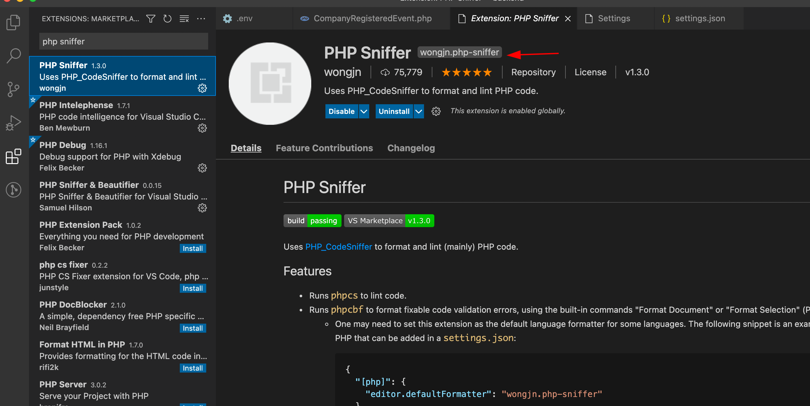
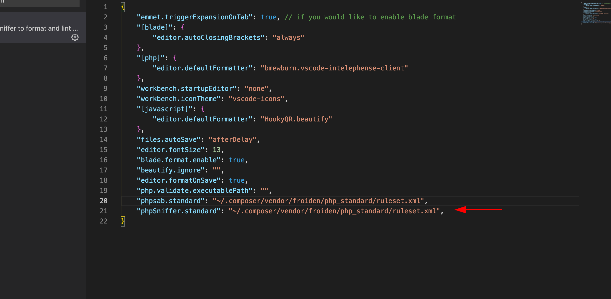

# PHP Coding Standard
This repository contains rulesets for **PHP CodeSniffer** and **PHP Mess Detector** along with some custom rules.

## Installation
Install this repository globally using composer:

	composer global require mrchetan/php_standard

Always use the latest version of the repository.

## Setup
The project will be installed in global composer folder on your PC. 
* **Mac**: `.composer/vendor` folder in your home directory
* **Windows**: `AppData/Roaming/Composer/vendor` folder in your user directory
* **Ubuntu**: `.config/composer/vendor` folder in your home directory

You follow the steps respective to your favourite IDE to configure PHP CodeSniffer and PHP MessDetector and point to the two rulesets in the installation folder.
* **ruleset.xml** - For CodeSniffer
* **rulesetmd.xml** - For MessDetector

## Attribution
Some sniffs in this repository have been derived from original PHP_CodeSniffer project. Credits for those go to the respective developers.

## VS Code SETUP
Install the extension name **PHP Sniffer** by **wongjn**

After Activation add the below file to settings.json file

For Mac

	"phpSniffer.standard": "~/.composer/vendor/mrchetan/php_standard/ruleset.xml",

For Linux

	"phpSniffer.standard": "~/.config/composer/vendor/mrchetan/php_standard/ruleset.xml",

For Windows

	"phpSniffer.standard": "%userprofile%/AppData/Roaming/Composer/vendor/mrchetan/php_standard/ruleset.xml",

To check 

	phpcs --standard=<PATH_OF_RULESET> <SPACE> <PATH_OF_FILEs_CHECK>

TO fix

	phpcbf --standard=<PATH_OF_RULESET> <SPACE> <PATH_OF_FILEs_CHECK>

Ignoring a file

	// @codingStandardsIgnoreFile

	// phpcs:ignoreFile

Ignoring a line

	// @codingStandardsIgnoreLine

	// phpcs:ignore

Ignoring a block

	// @codingStandardsIgnoreStart

	// phpcs:disable

	// @codingStandardsIgnoreEnd

	// phpcs:enable